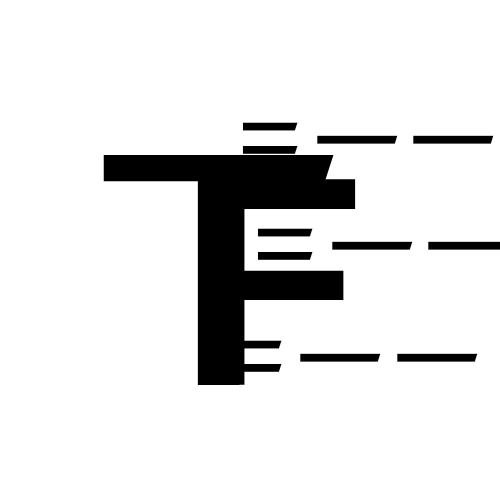

# Polaris_BackEnd_Frame————北极星后端框架

#### 介绍

一个小团队自研的后端框架

ProjectDevelopTeam:

1. YukinaNetwork -- TINUOKAS1
1. BannerTeam -- xiguawannian
1. Kalayia
1. lovol

### How to use our project?

您需要一个PHP8环境，并且有CLI服务器

### 这个是干什么用的？

本项目旨在使个人网页开发者能够快速构建后端并且上载项目，我们封装了很多的后端API来供你使用！

API详情见维基